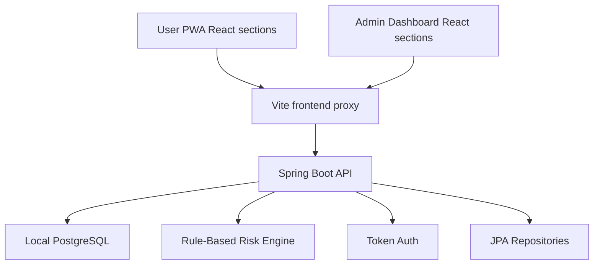

# Architecture Notes



## Runtime Shape

- Frontend runs on `http://localhost:5173`
- Backend runs on `http://localhost:8080`
- PostgreSQL runs locally on `localhost:5432`
- Docker is not part of the runtime or setup
- Vite proxies `/api` calls to the backend

## Backend

- Java Spring Boot
- Spring Web MVC
- Spring Data JPA
- Bean Validation
- PostgreSQL for local runtime
- H2 for the test profile
- Seeded demo user/admin accounts
- User-scoped assessment listing
- Admin analytics, rules, and questions endpoints

## Frontend

The frontend is organized by section instead of a single monolithic entry file:

```text
src/
  main.tsx
  App.tsx
  MainContent.tsx
  api.ts
  data.ts
  types.ts
  utils.ts
  components/
    DesignPicker.tsx
    RiskPill.tsx
    Sidebar.tsx
    StatCard.tsx
    Topbar.tsx
  pages/
    admin/
    auth/
    user/
```

## Current MVP Scope

- Landing page and login/signup flow
- User health assessment workspace
- Searchable symptom drawer
- Rule-based Low, Medium, High risk output
- Follow-up questions after assessment
- Assessment history and profile views
- Admin analytics overview
- Admin assessment, rule, question, and dataset sections
- No real patient data and no diagnosis

## Test Coverage

- Backend Spring context test with H2 profile
- Frontend section render tests for auth, user, admin, and layout sections
- Frontend TypeScript and production build validation
