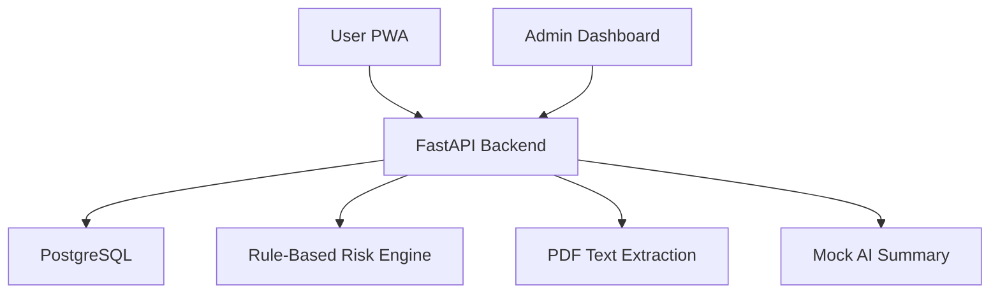

# Architecture Notes

## Current MVP Scope

- Separate User and Admin frontend workspaces
- PostgreSQL-backed FastAPI API
- Email or username login
- Demo admin and user seed accounts
- Synthetic assessments and analytics
- Rule-based Low, Medium, High risk output
- Text-based PDF extraction with mock summary
- No real patient data and no diagnosis
