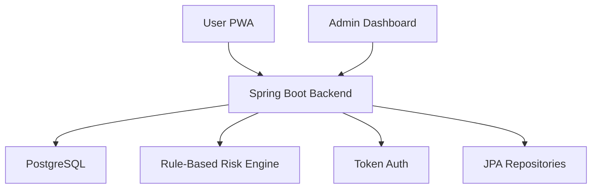

# Architecture Notes

## Current MVP Scope

- Separate User and Admin frontend workspaces
- PostgreSQL-backed Spring Boot API
- Email or username login
- Demo admin and user seed accounts
- User-owned assessments and admin analytics
- Rule-based Low, Medium, High risk output
- Frontend TypeScript app with landing page and auth flow
- Dynamic follow-up questions
- Fixed searchable symptom drawer
- No real patient data and no diagnosis
