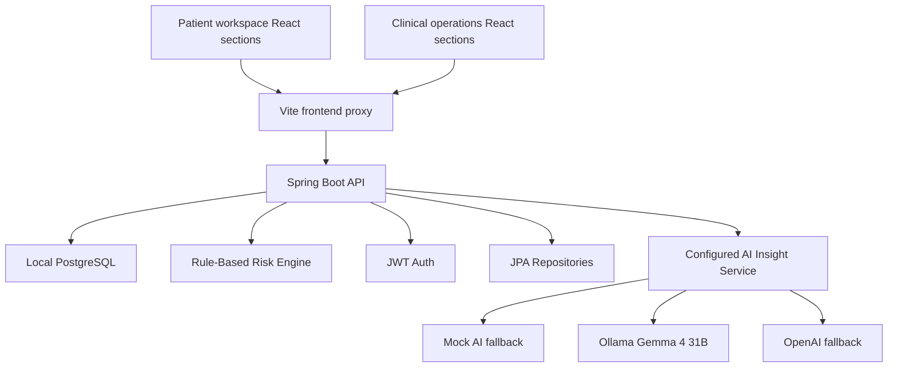
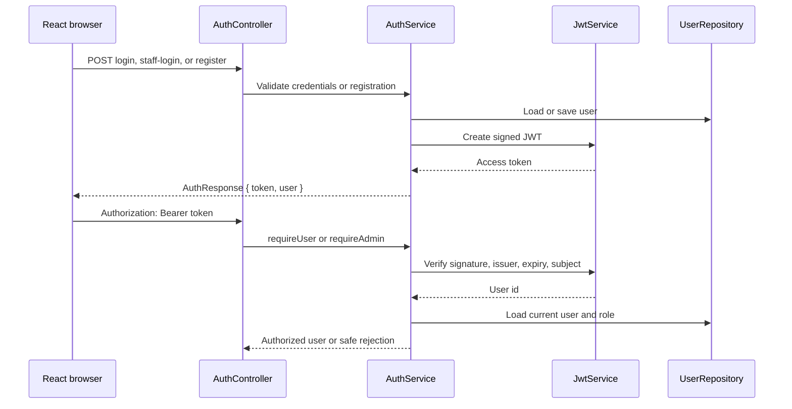
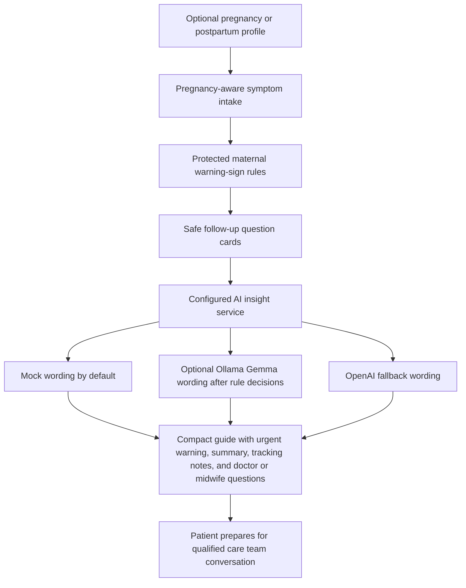

# Architecture Notes


```mermaid
flowchart TD
  A["Patient workspace React sections"] --> B["Vite frontend proxy"]
  C["Clinical operations React sections"] --> B
  B --> D["Spring Boot API"]
  D --> E["Local PostgreSQL"]
  D --> F["Rule-Based Risk Engine"]
  D --> G["JWT Auth"]
  D --> H["JPA Repositories"]
  D --> I["Configured AI Insight Service"]
  I --> J["Mock AI fallback"]
  I --> K["Ollama Gemma 4 31B"]
  I --> L["OpenAI fallback"]
```

## Runtime Shape

- Frontend runs on `http://localhost:5173`
- Backend runs on `http://localhost:8080`
- PostgreSQL runs locally on `localhost:5432`
- Docker is not part of the runtime or setup
- Vite proxies `/api` calls to the backend and can use `VITE_API_PROXY_TARGET` for alternate local backend ports

## Backend

- Java Spring Boot
- Spring Web MVC
- Springdoc OpenAPI / Swagger UI for local endpoint review
- Spring Data JPA
- Bean Validation
- PostgreSQL for local runtime
- H2 for the test profile
- Patient-only public registration
- Adult signup with cm or ft/in height entry, centimeter storage, and stored privacy-notice and terms acknowledgments
- Separate patient and staff login paths
- Seeded demo patient/staff accounts
- Explicit seven-card health-history review with backend-owned completion state
- Patient-owned pending drafts with resume and discard actions
- Completed-only patient history and staff analytics
- Protected built-in red flags plus upward-only operational safety rules
- Symptom-matched active staff questions for future assessment drafts
- Summary-first care-preparation results with expandable detail sections
- Backend-owned `ConfiguredAiInsightService` with default mock output and optional Ollama -> OpenAI -> mock provider mode
- Admin analytics, rule management, question management, and read-only staff profile
- OpenAPI documentation at `/swagger-ui.html`, `/v3/api-docs`, and `/v3/api-docs.yaml`

The frontend never calls AI providers and never stores provider keys. In provider mode, the backend tries `OllamaInsightClient` with `gemma4:31b`, then `OpenAiInsightClient`, then `MockAiInsightService`. The rule engine still owns score, risk, and urgent warning behavior, and provider errors fall to the next safe fallback.

## JWT Authentication Flow


```mermaid
sequenceDiagram
  participant Browser as React browser
  participant Auth as AuthController
  participant Service as AuthService
  participant JWT as JwtService
  participant DB as UserRepository

  Browser->>Auth: POST login, staff-login, or register
  Auth->>Service: Validate credentials or registration
  Service->>DB: Load or save user
  Service->>JWT: Create signed JWT
  JWT-->>Service: Access token
  Service-->>Browser: AuthResponse { token, user }
  Browser->>Auth: Authorization: Bearer token
  Auth->>Service: requireUser or requireAdmin
  Service->>JWT: Verify signature, issuer, expiry, subject
  JWT-->>Service: User id
  Service->>DB: Load current user and role
  Service-->>Auth: Authorized user or safe rejection
```

JWT keeps the browser contract simple while removing the old in-memory token map. The token proves the login session until expiry, but PMS still loads the current user from the database and checks the database role for staff-only actions.

## Future Pregnancy Care-Preparation Flow


```mermaid
flowchart TD
  A["Optional pregnancy or postpartum profile"] --> B["Pregnancy-aware symptom intake"]
  B --> C["Protected maternal warning-sign rules"]
  C --> D["Safe follow-up question cards"]
  D --> E["Configured AI insight service"]
  E --> F["Mock wording by default"]
  E --> G["Optional Ollama Gemma wording after rule decisions"]
  E --> H["OpenAI fallback wording"]
  F --> I["Compact guide with urgent warning, summary, tracking notes, and doctor or midwife questions"]
  G --> I
  H --> I
  I --> J["Patient prepares for qualified care team conversation"]
```

In `PMS_Test3`, pregnancy support remains future scope. Maternal warning signs must be Java-owned protected rules. Optional Ollama/OpenAI wording may improve readability only after rule decisions are complete and must never diagnose, estimate fetal condition, prescribe medication, or lower urgent warnings.

## Frontend

The frontend is organized by section instead of a single monolithic entry file:

```text
src/
  main.tsx
  App.tsx
  MainContent.tsx
  api.ts
  data.ts
  types.ts
  utils.ts
  components/
    AssessmentReportDrawer.tsx
    DesignPicker.tsx
    RiskPill.tsx
    Sidebar.tsx
    StatCard.tsx
    Topbar.tsx
  pages/
    admin/
    auth/
    user/
```

## Current MVP Scope

- Landing page, legal notice pages, three-step adult patient signup, and Staff login flow
- Patient health assessment workspace
- Grouped searchable symptom drawer
- Rule-based Low, Medium, High risk output
- Resumable pending intake followed by required follow-up cards and completed care guide
- Compact summary-first result view with a full-details toggle
- Assessment history, reusable completed-report drawer, and labeled profile views
- Clinical operations analytics overview
- Full-width staff care review, operational safety-rule management, managed questions, and read-only staff profile
- No real patient data and no diagnosis

## Test Coverage

- Backend Spring context test with H2 profile
- Backend controller tests for OpenAPI paths, patient API flow, staff authorization, admin rules/questions, and negative API cases
- Backend AI tests for mock default mode, Ollama -> OpenAI -> mock fallback, rule-owned urgent warnings, and provider structured-output parsing
- Frontend section render tests for auth, user, admin, and layout sections
- Frontend care-guide tests for compact summary, expanded details, urgent warning visibility, and drawer expanded mode
- Frontend TypeScript and production build validation
